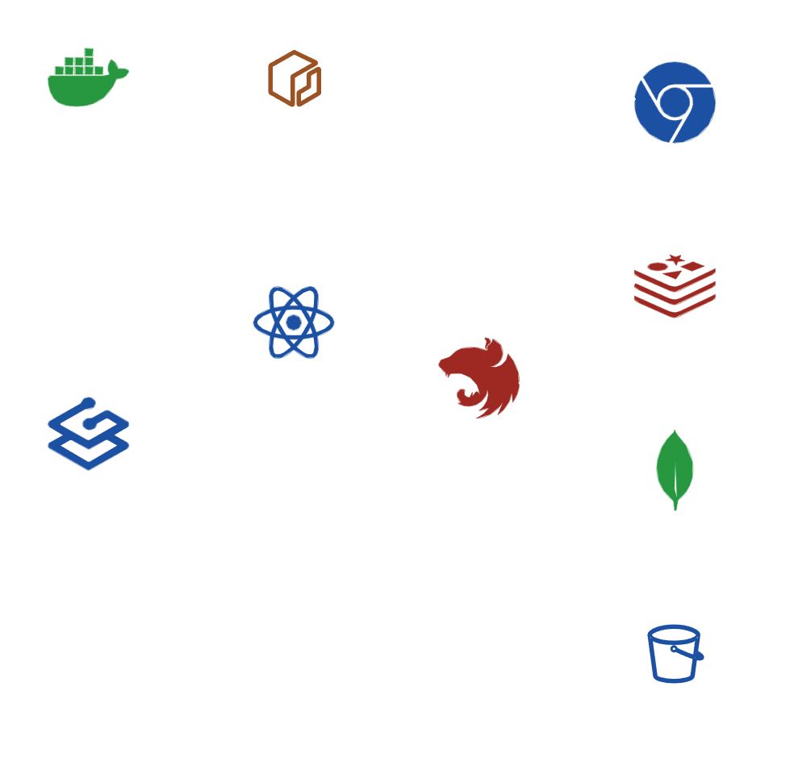

# Deployment

This configuration is used to deploy the UCC application on a server using Docker and Docker Compose. The application consists of multiple services, defined in the `docker-compose.yml` file, that work together to provide the full functionality of the application.

## Components

This is the infrastructure definition of the UCC Portal application:



The application is composed of the following services:

- **Traefik**: Traefik is used as a reverse proxy and load balancer for the application. It handles routing, SSL termination, and automatic Let's Encrypt certificate generation and renewal.
- **Client**: The client container runs the frontend application built with React.
- **Server**: The server container runs the backend application built with NestJS. Multiple instances of the server container can be run to scale the application.
- **Browserless**: Browserless is a web browser as a service, used for rendering PDFs server-side.
- **Minio**: Minio is an S3-compatible object storage server used for storing files and media.
- **Redis**: Redis used for caching and queuing.
- **Watchtower**: Watchtower is optional and can be used to automatically update the application containers when new images are available.

## Steps to Deploy

### Pre-requisites

1. **Docker and Docker Compose**: Make sure you have Docker and Docker Compose installed on your system.
2. **Domain Name**: You will need a domain name to configure the application. The domain should be pointed to the server where the application will be deployed.
3. **Port Configuration**: Ensure that the following ports are publicly accessible:
   - 80 (HTTP)
   - 443 (HTTPS)

### Update Environment Variables

Create the required `.env` files for the server, browserless, and minio services, and populate them with the necessary environment variables.

> [!NOTE]  
> When using Watchtower, `deployment/watchtower/docker/config.json` should be created and populated with the necessary configuration to allow Watchtower to query ECR for new images.

## Start the Application

1. Clone this repository and navigate to the `deployment` directory.
2. Run the following command to start the application:

```bash
docker-compose up -d
```

This command will start the application in detached mode, running the services defined in the `docker-compose.yml` file.

Assuming hostname is `example.com`, the application should be accessible at `https://example.com`. The MinIO dashboard should be accessible at `https://minio.example.com/console/`.
